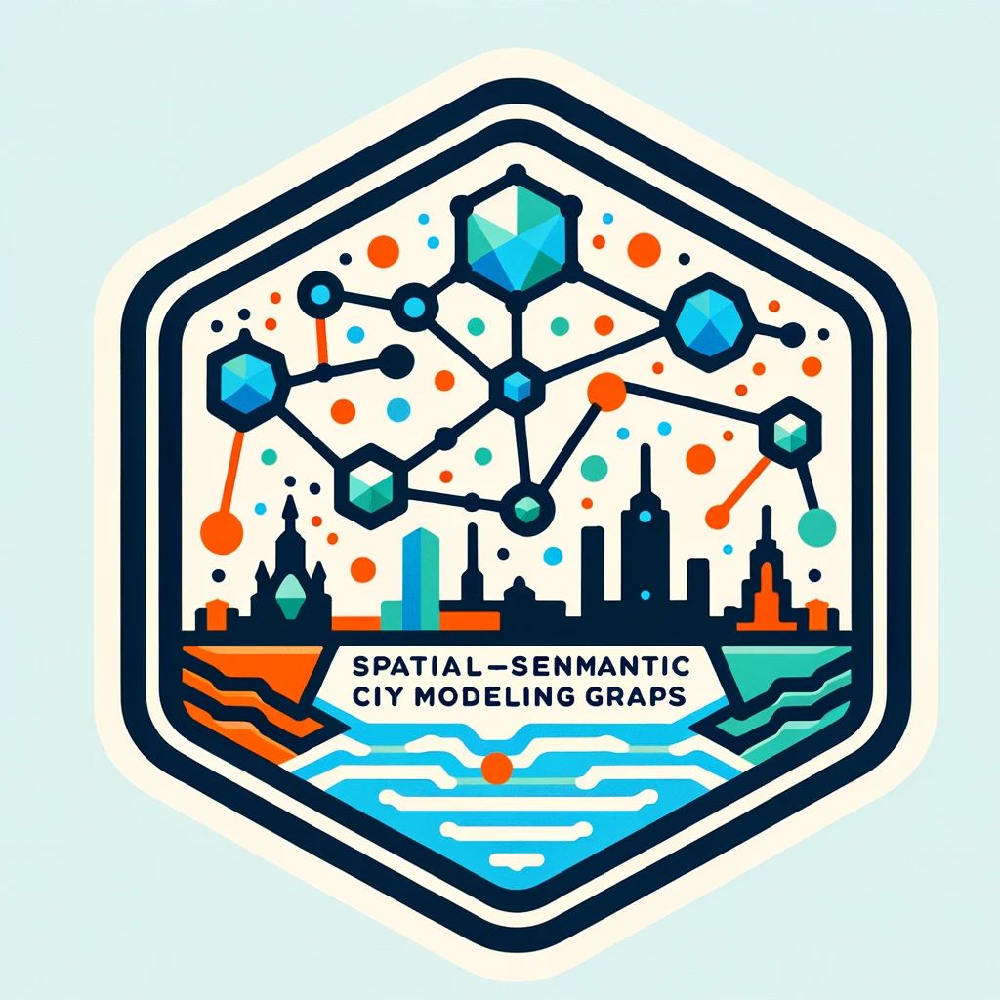
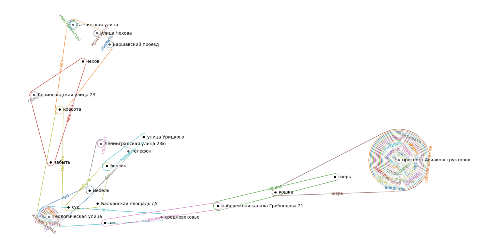

# SOIKA
[](https://www.repostatus.org/#active)
[](https://soika.readthedocs.io/ru/latest/?badge=latest)
[](https://pypi.org/project/scikit-learn/)
[](https://github.com/psf/black)
[](https://github.com/GeorgeKontsevik/soika/actions/workflows/2dev_ci_on_pr.yaml)

[](https://t.me/soika_community)
[](https://colab.research.google.com/drive/1wCUJAqlq9GMKw1wpTsWrzYwr10pWDeHv?usp=sharing)



**SOIKA** - это библиотека, нацеленная на обогащение цифровых моделей городов данными, получаемыми из текстовых данных цифрового следа горожан, 
а также на моделирование вернакулярной оценки качества городской среды.

Основным ее элементом является конструируемый 
пространственно-семантический гиперграф, пополняемый при помощи машинного распознавания городских сущностей и локаций.

SOIKA также предоставляет методы для моделирования
социальных рисков относительно эмоциональной оценки упоминаемых мест.


Данные, полученные после сбора и обработки данных в SLOYK'е, представляют собой пространственно-семантический гиперграф:



## Лицензия

Проект имеет лицензию [MIT License](./LICENSE).

## Контакты

- [НЦКР](https://actcognitive.org/o-tsentre/kontakty) - Национальный Центр Когнитивных Разработок.
- [ИДУ](https://idu.itmo.ru/en/contacts/contacts.htm) - Институт Дизайна и Урбанистики.
- Если у вас есть вопросы или предложения, вы можете связаться с нами по следующему адресу:
asantonov@itmo.ru (Александр Антонов, Project Lead)
kontsevik@itmo.ru (just in case).

## Цитирование

``` bibtex
@inproceedings{antonov2024transformation,
  title={Transformation of Local Communities from Neighborhoods to Urban Commons in the Production of Social Representations of Space},
  author={Antonov, Aleksandr and Gornova, Galina and Kontsevik, Georgii and Turkov, Leonid and Vorona, Vladimir and Mityagin, Sergey},
  booktitle={International Conference on Computational Science and Its Applications},
  pages={436--447},
  year={2024},
  organization={Springer}
}
```
---
