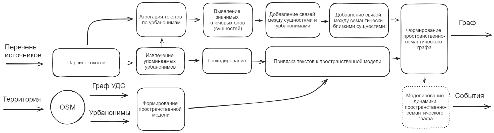

# SLOYKA

<!--  -->

**SLOYKA** - это библиотека, нацеленная на обогащение цифровых моделей городов данными, получаемыми из текстовых данных цифрового следа горожан, 
а также на моделирование вернакулярной оценки качества городской среды.

Основным ее элементом является конструируемый 
пространственно-семантический граф, пополняемый при помощи машинного распознавания городских сущностей и локаций.

SLOYKA включает в себя две группы методов: методы для генерации пространственно-семантического графа и методы для моделирования
социальных процессов с его помощью.

Схематичное описание работы библиотеки:
<!--  -->

  

**Модуль генерации пространственного-семантического графа**

Пространственно-семантический граф состоит из двух взаимосвязанных компонентов: 
- Пространственный граф, отображающий географическую близость различных именованных сущностей на территории города (улиц, организаций, парков, точек притяжения и др.)
- Семантический граф, отображающий смысловую и фактологическую близость различных городских сущностей (природных явлений, объектов городской среды, городских пользователей).

Пространственный граф строится по следующему алгоритму:
1. Пользователь подает на вход набор текстов и указание на территорию
2. Из OSM загружается сеть УДС в виде графа и именованные сущности
3. От именованных сущностей строится евклидово расстояние до ближайшего узла графа, оно пишется в новое ребро
4. В текстах выявляются урбанонимы (городские названия). Процесс выполняется при помощи дообученной
[модели](https://huggingface.co/Geor111y/flair-ner-addresses-extractor) RuBert и набора эвристик для геокодирования без использования сторонних сервисов
1. Сначала они геокодируются по адресной системе, потом по названиям объектов. Также учитываются варианты народных написаний
2. Для событий в тексте определяется вероятность локализации. Она может быть увеличена при появлении новых текстов для тех же событий
3. Процесс может выполняться периодично, в таком случае появляется возможность определения активных и латентных территорий

Семантический граф строится по следующему алгоритму:
1. Пользователь подает на вход набор текстов и указание на территорию (Санкт-Петербург)
2. Из текста извлекаются сущности, их контекст, добавляются в узлы
3. Определяется семантическая близость сущностей, наиболее близкие объединяются
4. Дополнительно выделяются опорные узлы-урбанонимы
5. Формируются фактологические связи в виде ребер
6. Сущности не удаляются из графа с течением времени, но имеют период активности. Повторное упоминание обновляет его
<!-- 
 -->

**Модуль моделирования социальных процессов с помощью пространственного-семантического графа**
- В процессе разработки -

Предполагаемые сценарии использования методов:
- Отслеживание социально значимых ситуаций
- Прогнозирование динамики семантического графа
- Нахождение городских сообществ
- Определение идентичности мест
- Определение вернакулярных районов
- Определение точек притяжения

## Особенности SLOYKA

- Готовый к использованию инструмент для исследователей и аналитиков, работающих с неструктурированными социальными данными. Наша библиотека поможет извлечь факты из текстов, описывающих городские процессы и явления
- Модульная структура библиотеки позволяет получать и использовать только необходимые части, например, если ваша единственная цель - обогащение модели города пространственными данными о дорожно-транспортных происшествиях
- Эта библиотека может быть использована для моделирования и анализа социальных процессов в городе на основе текстовых данных, выявляя их смысловые и пространственные параметры

<!-- Сравнение результата геокодирования с существующим решением:

Выделение комьюнити на основе жалоб горожан по различным тематикам:

Процентное соотношение жалоб по категориям среди выделенных комьюнити:
 -->

<!-- Сравнение результата геокодирования с существующим решением:
 -->
<!-- 
## Installation

- В разработке -->

## Структура проекта

Последняя стабильная версия библиотеки SLOYKA находится в [master branch](https://github.com/GeorgeKontsevik/sloyka/tree/master) 

<!-- Репозиторий включает в себя следующие директории:

* Пакет [core](https://github.com/GeorgeKontsevik/sloyka/tree/master/factfinder)  содержит основные классы и скрипты. Это *ядро* SLOYKA;
* Пакет [examples](https://github.com/GeorgeKontsevik/sloyka/tree/master/examples) включает в себя несколько *how-to-use кейсов*, где вы можете разобраться в принципах работы SLOYKA;
* All *unit and integration tests* can be observed in the [test]() directory;
* The sources of the documentation are in the [docs](https://github.com/GeorgeKontsevik/sloyka/tree/master/docs)  -->
                                                        
<!-- ## Examples
Вы можете использовать свои собственные данные, но они должны соответствовать спецификации. Следующие примеры помогут освоиться с библиотекой:

1. [Geocoder](examples/geocoder_example.ipynb) - как извлечь топонимы и получить их координаты -->

<!-- ## Документация

- В разработке

## Разработка

Чтобы начать разработку библиотеки, необходимо выполнить следующие действия:

1. Клонировать репозиторий (`git clone https://github.com/GeorgeKontsevik/sloyka.git`);
2. Создайте виртуальную среду, так как для библиотеки требуются точные версии пакетов, и активировать ее: `python -m venv venv`;
3. Установить библиотеку в редактируемом режиме: `python -m pip install -e '.[dev]' --config-settings editable_mode=strict`;
4. Установить pre-commit hooks: `pre-commit install`;
5. Создать новую ветку на основе **develop**: `git checkout -b develop <new_branch_name>`;
6. Внести изменения в код;
7. Сделайте коммит, переместите новую ветку и создайте запрос на мердж **develop**.

Редактируемая установка позволяет свести количество переустановок к минимуму. Разработчику необходимо повторить шаг 3 в случае добавления новых файлов в библиотеку.

A more detailed guide to contributing is available in the [documentation](docs/source/contribution.rst). -->

## Лицензия

Проект имеет лицензию [MIT License](./LICENSE).

## Контакты

- [НЦКР](https://actcognitive.org/o-tsentre/kontakty) - Национальный Центр Когнитивных Разработок;
- [ИДУ](https://idu.itmo.ru/en/contacts/contacts.htm) - Институт Дизайна и Урбанистики;
- Если у вас есть вопросы или предложения, вы можете связаться с нами по следующему адресу: asantonov@itmo.ru (Александр Антонов).

## Цитирование

---

